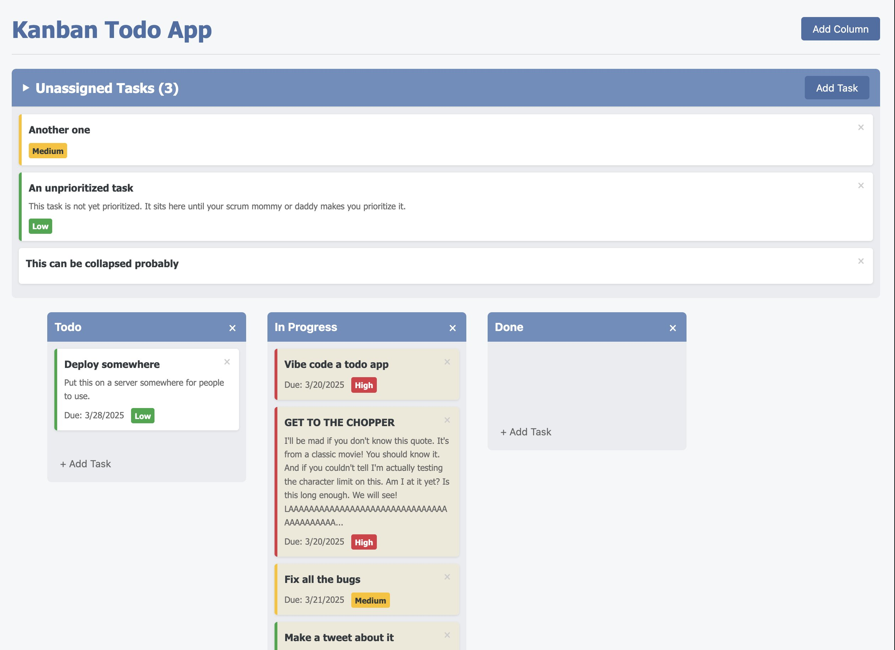

# Vibe Coded Todo App

This is a vibe coded todo app. I used Cursor to build it. I only minimally edited the code by hand and tried to make all changes by only giving Claude instructions. This took much trial and effort lol.

It is all vanilla JS / CSS / HTML. No libraries or frameworks. It's janky as hell and probably buggy as fuck. There is no build.

To run you'll need to use some kind of web server (I just stick it behind an Nginix static file server running in docker). I a'int here to teach you all that. This was just an experiment.

## Screenshot

